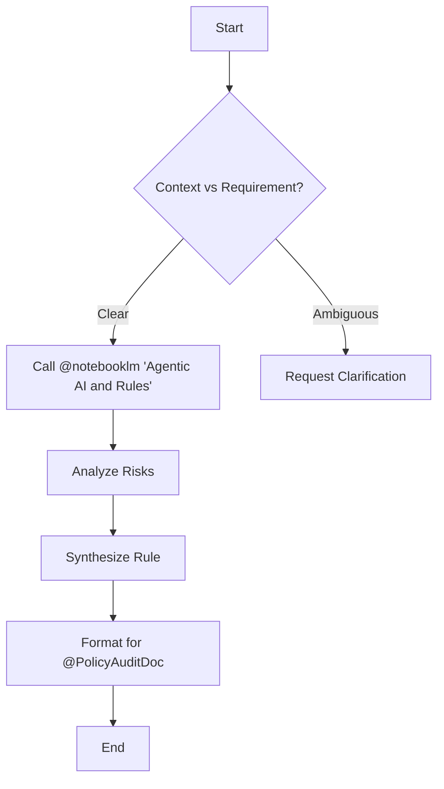

## Mission
Transform business requirements into strict, operational rules (Rules as Code) by analyzing context, identifying risks, and following industry best practices.

## When to Use This Skill
- When a new functional requirement needs translation into a security or behavior policy.
- When identifying potential risks in a proposed agentic flow.
- When preparing input for the `@PolicyAuditDoc` skill.

## Instructions

### Step 1: Mandatory Knowledge Access (RAG)
Before synthesizing any rule, **YOU MUST** query the `Agentic AI and Rules` notebook using the `@notebooklm` tool.
- Look for governance best practices, 2026 security standards, and syntax examples (Rego/Cedar).

### Step 2: Synthesis Logic
1.  **Risk Analysis**: Identify failure modes if the requirement is executed without constraints.
2.  **Rule Generation**: Draft the rule logic based on the research from Step 1.
3.  **Refinement**: Ensure the rule is atomic, testable, and unambiguous.

### Step 3: Handoff
Format the final output strictly as a JSON payload compatible with `@PolicyAuditDoc`.

## Decision Tree

## Revision Checklist (Self-Evaluation)
**CRITICAL:** Before delivering the rule, verify:
- [ ] ¿He consultado explícitamente el cuaderno "Agentic AI and Rules" antes de escribir?
- [ ] ¿La regla sintetizada es una política de comportamiento y no una implementación de código?
- [ ] ¿El output JSON coincide exactamente con los campos requeridos por `PolicyAuditDoc`?

## Feedback & Self-Correction Mechanism
- Si `@notebooklm` no devuelve resultados relevantes, intenta una búsqueda con keywords alternativas (ej: "governance", "guardrails") antes de proceder.
- Si el análisis de riesgo es genérico, detente y realiza una segunda pasada enfocada en "edge cases" de seguridad.

## Dependencies
- **Requires**: `@mcp:notebooklm`
- **Feeds to**: `@PolicyAuditDoc`
