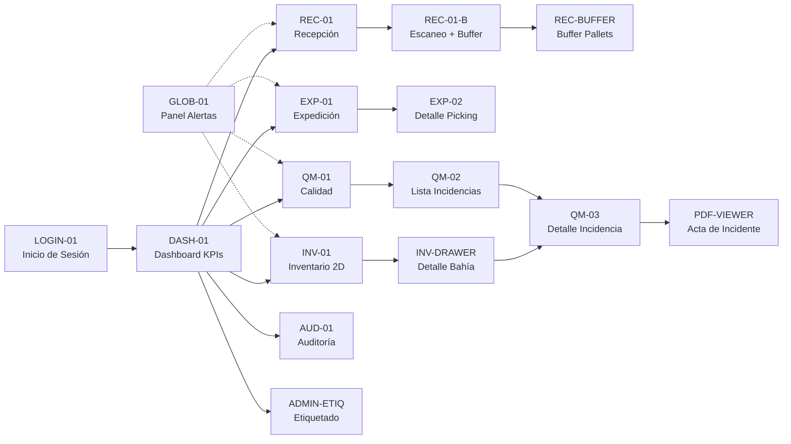
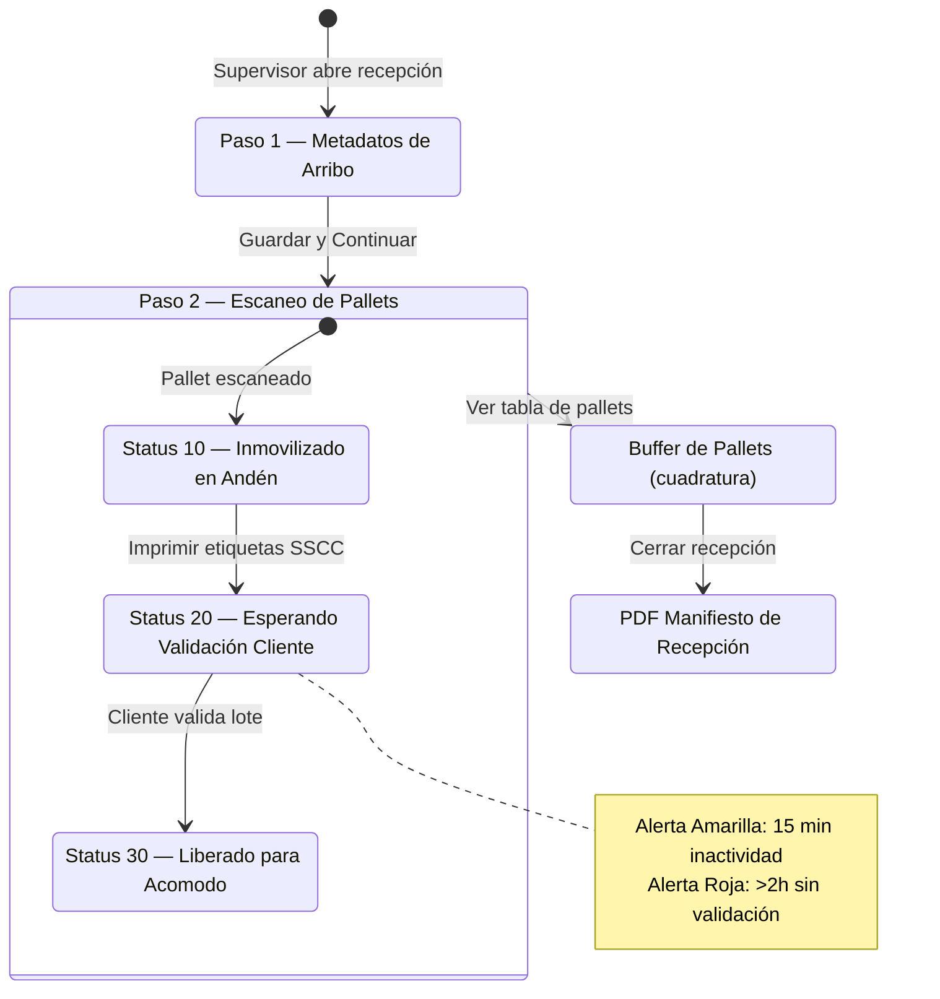
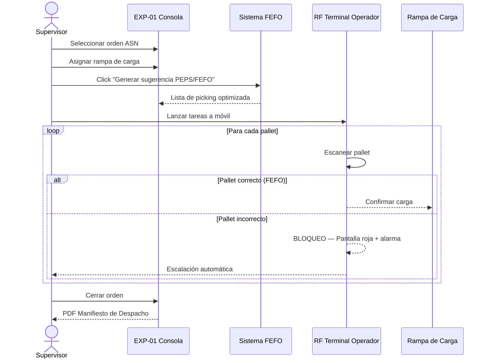
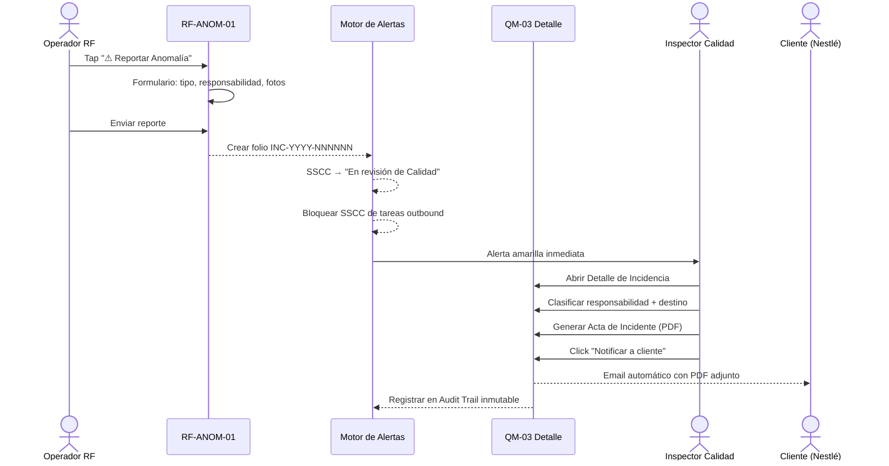
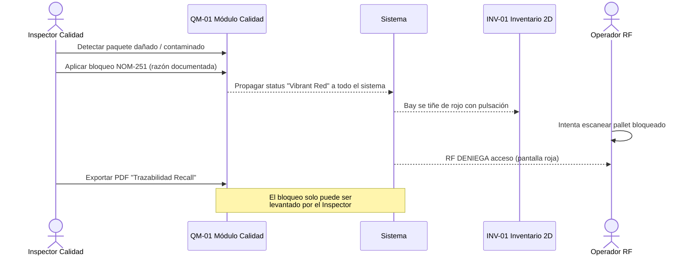
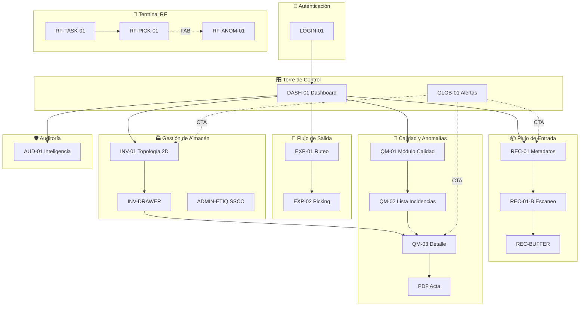
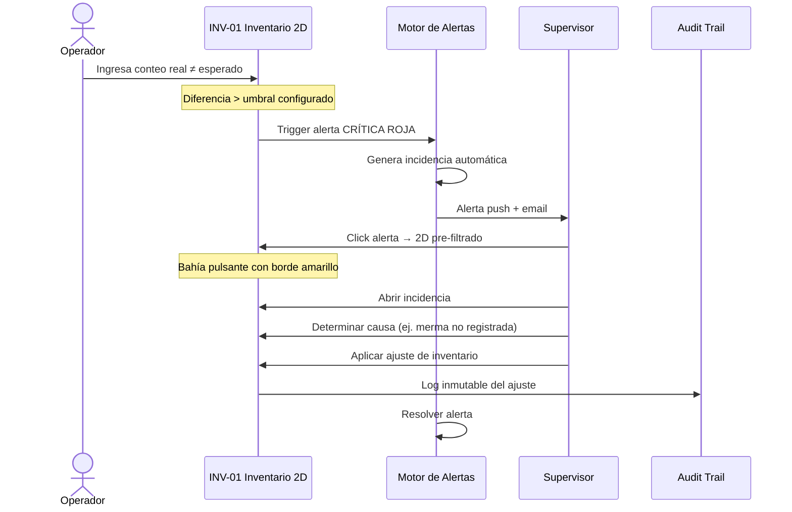

# 4-GUARD WMS — Plan Integral de Diseño UI/UX

> **Versión**: 1.0 — 20 Mar 2026  
> **Fuentes**: Especificaciones Funcionales V7, Anomalías V6.1, 20 pantallas `stitch_src`, NotebookLM 4-GUARD WMS

---

## A — Catálogo Consolidado de Pantallas

| # | Screen ID | Nombre | Módulo | Device | Roles con Acceso | Ruta Propuesta |
|---|-----------|--------|--------|--------|-----------------|----------------|
| 1 | `LOGIN-01` | Inicio de Sesión | Auth | Desktop | Todos | `/login` |
| 2 | `DASH-01` | Dashboard de KPIs | Dashboard | Desktop | Supervisor, Gerente, Auditor | `/dashboard` |
| 3 | `REC-01` | Consola de Recepción — Paso 1: Metadatos | Recepción | Desktop | Supervisor | `/recepcion/metadatos` |
| 4 | `REC-01-B` | Consola de Recepción — Unificada (Scan + Buffer) | Recepción | Desktop | Supervisor | `/recepcion/escaneo` |
| 5 | `EXP-01` | Consola de Expedición y Ruteo | Expedición | Desktop | Supervisor | `/expedicion` |
| 6 | `EXP-02` | Detalle de Picking / Carga | Expedición | Desktop | Supervisor | `/expedicion/:orderId/picking` |
| 7 | `INV-01` | Inventario 2D — Topología Cromática | Inventario | Desktop | Supervisor, Gerente | `/inventario/topologia` |
| 8 | `QM-01` | Módulo de Calidad — Registro de Incidencias | Calidad | Desktop | Inspector, Supervisor | `/calidad` |
| 9 | `QM-02` | Lista de Incidencias de Anomalía | Calidad | Desktop | Inspector, Supervisor | `/calidad/incidencias` |
| 10 | `QM-03` | Detalle de Incidencia | Calidad | Desktop | Inspector | `/calidad/incidencias/:folioId` |
| 11 | `ADMIN-ETIQ-SSCC` | Administrador de Etiquetado SSCC | Etiquetado | Desktop | Supervisor | `/etiquetado` |
| 12 | `AUD-01` | Auditoría e Inteligencia — Trail inmutable | Auditoría | Desktop | Auditor, Gerente | `/auditoria` |
| 13 | `GLOB-01` | Panel de Alertas Global (Drawer) | Alertas | Desktop | Todos (según rol) | Drawer overlay |
| 14 | `RF-ANOM-01` | Reporte de Anomalía (Terminal RF) | Anomalías | **Mobile** | Operador | `/rf/anomalia` |
| 15 | `RF-TASK-01` | Menú de Tareas Operador (Terminal RF) | Terminal RF | **Mobile** | Operador | `/rf/tareas` |
| 16 | `RF-PICK-01` | Picking Guiado (Terminal RF) | Terminal RF | **Mobile** | Operador | `/rf/picking/:taskId` |
| 17 | `PDF-VIEWER-QM-03` | Visor PDF — Acta de Incidente | Calidad | Desktop | Inspector, Auditor | Modal overlay |
| 18 | `VAULT-CORE-UI` | Vault Core UI — Design System Showcase | Sistema | Desktop | Dev reference | `/vault/core` |
| 19 | `REC-BUFFER` | Buffer de Pallets Escaneados | Recepción | Desktop | Supervisor | `/recepcion/buffer` |
| 20 | `INV-DRAWER` | Drawer Lateral de Bahía (INV-01 child) | Inventario | Desktop | Supervisor, Gerente | Drawer overlay |

> [!NOTE]
> Las pantallas marcadas como **Mobile** usan la interfaz de Terminal RF con Bottom Nav Bar en lugar de Side + Top Nav. Las pantallas Desktop comparten un layout fijo con `SideNavBar` (264px) + `TopBar` (64px).

---

## B — Índice de Flujos de Pantalla

### B.1 — Mapa de Navegación General



### B.2 — Flujo de Recepción (Máquina de Estados 10/20/30)



### B.3 — Flujo de Expedición (PEPS/FEFO Algorítmico)



### B.4 — Flujo de Anomalía Operativa (RF-ANOM-01)



### B.5 — Flujo de Bloqueo Sanitario NOM-251



---

## C — Walkthroughs por Rol

### C.1 — 🔧 Operador / Montacarguista

**Dispositivo**: Terminal RF móvil (pantalla táctil industrial)  
**Interfaz**: Botones masivos, alto contraste, formularios simplificados

| Paso | Acción | Pantalla | Resultado |
|------|--------|----------|-----------|
| 1 | Login con credencial de badge | `LOGIN-01` | Acceso al menú de tareas |
| 2 | Ver lista de tareas asignadas | `RF-TASK-01` | Tareas de acomodo / picking disponibles |
| 3 | Seleccionar tarea de picking | `RF-PICK-01` | Ruta guiada paso a paso |
| 4 | Escanear pallet indicado | `RF-PICK-01` | ✅ Confirmación o ❌ Bloqueo FEFO |
| 5 | Detectar paquete roto | — | Pulsa botón flotante `⚠ Reportar Anomalía` |
| 6 | Llenar formulario de anomalía | `RF-ANOM-01` | Selección tipo + fotos + comentario |
| 7 | Enviar reporte | `RF-ANOM-01` | Toast verde "Folio INC-2026-NNNNNN creado" |
| 8 | Continuar tarea activa | `RF-PICK-01` | Regresa a la tarea donde estaba |

### C.2 — 👔 Supervisor / Líder de Turno

**Dispositivo**: Desktop / Tablet  
**Interfaz**: Consola completa con SideNav + TopBar

| Paso | Acción | Pantalla | Resultado |
|------|--------|----------|-----------|
| 1 | Login | `LOGIN-01` | Acceso al Dashboard |
| 2 | Revisar KPIs generales | `DASH-01` | Saturación, alertas activas, rendimiento |
| 3 | Abrir recepción de camión | `REC-01` | Formulario metadatos: placas, sellos, chofer |
| 4 | Continuar a escaneo | `REC-01-B` | Buffer de pallets, estados 10/20 |
| 5 | Cerrar recepción | `REC-01-B` | Cuadratura OK → PDF Manifiesto |
| 6 | Gestionar orden de salida | `EXP-01` | Seleccionar ASN, asignar rampa |
| 7 | Generar picking FEFO | `EXP-01` | Lista algorítmica optimizada |
| 8 | Lanzar tareas a operador | `EXP-01` | Push a Terminal RF |
| 9 | Recibir alerta de anomalía | `GLOB-01` Drawer | Alerta amarilla con CTA |
| 10 | Navegar a Inventario 2D | `INV-01` | Bahía afectada con pulsación roja |
| 11 | Abrir detalle de bahía | `INV-DRAWER` | SSCC, incidencia vinculada |
| 12 | Aprobar ajuste de inventario | `INV-DRAWER` | Log en Audit Trail |

### C.3 — 🔬 Inspector de Calidad

**Dispositivo**: Desktop  
**Interfaz**: Consola completa, acceso restringido a módulo de Calidad

| Paso | Acción | Pantalla | Resultado |
|------|--------|----------|-----------|
| 1 | Login | `LOGIN-01` | Acceso restringido a QM + GLOB |
| 2 | Recibir alerta de incidencia | `GLOB-01` | CTA directo a incidencia |
| 3 | Abrir Lista de Incidencias | `QM-02` | Tabla filtrada: tipo, estado, cliente |
| 4 | Ver Detalle de Incidencia | `QM-03` | Fotos, comentarios del operador |
| 5 | Clasificar responsabilidad | `QM-03` | Daño interno / origen / externo |
| 6 | Clasificar destino del producto | `QM-03` | Merma / devolución / reacondicionamiento |
| 7 | Aplicar bloqueo NOM-251 | `QM-01` | SSCC → "Vibrant Red" en todo el sistema |
| 8 | Generar Acta de Incidente | `QM-03` | PDF inmutable con evidencia y firmas |
| 9 | Notificar al cliente | `QM-03` | Email automatizado con PDF adjunto |
| 10 | Exportar Trazabilidad Recall | `QM-01` | PDF para auditorías NOM-251/SAT |

### C.4 — 📊 Gerente de Operaciones

**Dispositivo**: Desktop  
**Interfaz**: Consola completa, énfasis en Dashboard y Analítica

| Paso | Acción | Pantalla | Resultado |
|------|--------|----------|-----------|
| 1 | Login | `LOGIN-01` | Dashboard como landing |
| 2 | Revisar KPIs diarios | `DASH-01` | Saturación (gauge SVG), errores (line chart), rendimiento operador (bar chart) |
| 3 | Analizar Topología 2D | `INV-01` | Mapa cromático de ocupación por bahía/rack |
| 4 | Filtrar por cliente o zona | `INV-01` | Filtros dinámicos: Nestlé, sector Alpha, etc. |
| 5 | Consultar AI Copilot | `AUD-01` | Preguntas en lenguaje natural sobre operaciones |
| 6 | Exportar reporte financiero | `DASH-01` | CSV/Excel de métricas operativas |
| 7 | Revisar historial de auditoría | `AUD-01` | Trail inmutable de todas las acciones |

### C.5 — 🛡️ Auditor / Cumplimiento

**Dispositivo**: Desktop  
**Interfaz**: Acceso solo lectura, énfasis en Auditoría

| Paso | Acción | Pantalla | Resultado |
|------|--------|----------|-----------|
| 1 | Login | `LOGIN-01` | Vista limitada a AUD + reportes |
| 2 | Consultar Audit Trail | `AUD-01` | Todos los eventos inmutables del sistema |
| 3 | Filtrar por operador, fecha, tipo | `AUD-01` | Búsqueda avanzada en trail |
| 4 | Exportar reporte de trazabilidad | `AUD-01` | PDF para SAT/Nestlé/reguladores |
| 5 | Revisar incidencias cerradas | `QM-02` | Historial read-only de resoluciones |
| 6 | Ver Acta de Incidente | `PDF-VIEWER-QM-03` | PDF en modal read-only |

---

## D — Diagramas de User Flow (Mermaid)

### D.1 — Flujo Maestro de Navegación



### D.2 — Discrepancia Sistémica de Inventario (Automática)



---

## E — Notas de Implementación Frontend

### E.1 — Estructura de Rutas (React / Next.js App Router)

```
app/
├── (auth)/
│   └── login/                    # LOGIN-01
├── (dashboard)/
│   └── page.tsx                  # DASH-01
├── recepcion/
│   ├── metadatos/                # REC-01
│   ├── escaneo/                  # REC-01-B
│   └── buffer/                   # REC-BUFFER
├── expedicion/
│   ├── page.tsx                  # EXP-01
│   └── [orderId]/picking/        # EXP-02
├── inventario/
│   └── topologia/                # INV-01 + INV-DRAWER
├── calidad/
│   ├── page.tsx                  # QM-01
│   ├── incidencias/              # QM-02
│   └── incidencias/[folioId]/    # QM-03
├── etiquetado/                   # ADMIN-ETIQ-SSCC
├── auditoria/                    # AUD-01
├── rf/                           # (Mobile-only layout)
│   ├── tareas/                   # RF-TASK-01
│   ├── picking/[taskId]/         # RF-PICK-01
│   └── anomalia/                 # RF-ANOM-01
└── vault/
    └── core/                     # VAULT-CORE-UI (dev ref)
```

### E.2 — Jerarquía de Componentes (Atomic Design)

```
components/
├── atoms/
│   ├── Button.tsx                # Primary, Secondary, Ghost, Danger
│   ├── Badge.tsx                 # Status badges (Blocked, Active, Closed)
│   ├── Input.tsx                 # Text, Select, Textarea (vault-styled)
│   ├── Icon.tsx                  # Material Symbols wrapper
│   ├── ProgressBar.tsx           # Linear + Circular (SVG gauge)
│   └── Chip.tsx                  # Filter chips, tag chips
│
├── molecules/
│   ├── SearchField.tsx           # Input + Icon + Clear button
│   ├── StepIndicator.tsx         # Wizard step tracker (REC-01)
│   ├── AlertBadge.tsx            # Bell icon + count + pulse
│   ├── MetricCard.tsx            # KPI display (value + label + trend)
│   ├── FilterDropdown.tsx        # Label + Select + Clear
│   └── StatusPill.tsx            # Colored status indicator
│
├── organisms/
│   ├── SideNavBar.tsx            # 264px fixed sidebar
│   ├── TopBar.tsx                # Sticky header with glass effect
│   ├── BottomNavBar.tsx          # Mobile RF bottom navigation
│   ├── DataTable.tsx             # Sortable, filterable, paginated
│   ├── AlertDrawer.tsx           # GLOB-01 categorized alerts
│   ├── BayDetailDrawer.tsx       # INV-DRAWER right panel
│   ├── InventoryGrid2D.tsx       # Chromatic topology grid
│   ├── SaturationGauge.tsx       # SVG circular gauge (DASH-01)
│   ├── AnomalyReportForm.tsx     # RF-ANOM-01 full form
│   └── VaultProtocolPanel.tsx    # Security checklist (REC-01)
│
├── templates/
│   ├── DesktopLayout.tsx         # SideNavBar + TopBar + main
│   ├── MobileRFLayout.tsx        # TopAppBar + main + BottomNavBar
│   └── AuthLayout.tsx            # Full-screen centered (LOGIN-01)
│
└── pages/  (assembled from templates + organisms)
```

### E.3 — Sistema de Design Tokens (3 Niveles)

```typescript
// tokens/primitives.ts — Raw values, no context
export const primitives = {
  color: {
    navy900: '#000666',
    navy800: '#1a237e',
    red600:  '#bb0112',
    red500:  '#e02928',
    amber500:'#f59e0b',
    emerald500:'#10b981',
    blue500: '#3b82f6',
    slate50: '#f7fafc',
    slate100:'#f1f4f6',
    slate200:'#e5e9eb',
    slate300:'#e0e3e5',
    slate400:'#c6c5d4',
    slate500:'#767683',
    slate700:'#454652',
    slate900:'#181c1e',
    white:   '#ffffff',
  },
  spacing: { 0: '0', 1: '4px', 2: '8px', 3: '12px', 4: '16px', 6: '24px', 8: '32px', 10: '40px', 12: '48px' },
  radius:  { none: '0', sm: '2px', md: '4px', lg: '8px', xl: '12px', full: '9999px' },
  font:    { display: "'Work Sans', sans-serif", body: "'Inter', sans-serif" },
};

// tokens/semantic.ts — Contextual meaning
export const semantic = {
  color: {
    surface:            primitives.color.slate50,
    surfaceContainerLow:primitives.color.slate100,
    surfaceContainer:   primitives.color.slate200,
    surfaceHighest:     primitives.color.slate300,
    onSurface:          primitives.color.slate900,
    primary:            primitives.color.navy900,
    primaryContainer:   primitives.color.navy800,
    danger:             primitives.color.red600,
    dangerContainer:    primitives.color.red500,
    warning:            primitives.color.amber500,
    success:            primitives.color.emerald500,
    info:               primitives.color.blue500,
    outline:            primitives.color.slate500,
    outlineVariant:     primitives.color.slate400,
  },
  // Dark mode: override semantic tokens only
  colorDark: {
    surface:            '#0f172a',
    onSurface:          '#e2e8f0',
    primaryContainer:   '#283593',
    /* ... */
  },
};

// tokens/component.ts — Component-specific
export const component = {
  button: {
    primary:   { bg: semantic.color.primaryContainer, text: primitives.color.white, hoverBg: semantic.color.primary },
    danger:    { bg: semantic.color.danger, text: primitives.color.white },
    ghost:     { bg: 'transparent', text: semantic.color.primary, border: semantic.color.outlineVariant },
  },
  badge: {
    blocked:   { bg: 'rgba(187,1,18,0.1)', text: semantic.color.danger, border: 'rgba(187,1,18,0.2)' },
    active:    { bg: '#ffdbca', text: '#773200' },
    closed:    { bg: semantic.color.surfaceHighest, text: semantic.color.outline },
    notified:  { bg: '#e0e0ff', text: '#343d96' },
  },
  anomalyPulse: { color: 'rgba(187,1,18,0.7)', duration: '2s', keyframes: 'pulse-red' },
};
```

### E.4 — Directrices de Estética Front Platino

| Principio | Implementación |
|-----------|---------------|
| **Liquid Glass** | SVG `feDisplacementMap` + `feSpecularLighting` en TopBar y modales flotantes. Fallback: `backdrop-filter: blur(12px)` |
| **Tipografía** | Títulos: Work Sans 700 (tracking tight, uppercase). Cuerpo: Inter 400/500. Labels: Inter 600 (11px, tracking widest, uppercase) |
| **Paleta** | Navy Deep `#000666` / `#1a237e` base. Vibrant Red `#bb0112` para peligro. No usar colores genéricos puros |
| **Ghost Borders** | `1px solid rgba(148,163,184,0.15)` — bordes fantasma que separan sin dominar |
| **Shadow Ambient** | `box-shadow: 0 10px 24px -6px rgba(30,41,59,0.06)` — sombras sugeridas, nunca dramáticas |
| **Anomaly Pulse** | `animation: pulse-red 2s infinite` con `box-shadow` expansivo para destacar bahías bloqueadas |
| **Dot Grid** | `radial-gradient(circle, #767683 1px, transparent 1px)` a 3% opacidad como fondo de áreas de trabajo |
| **Spring Animations** | Motion con `mass`, `stiffness`, `damping` para transiciones interruptibles (Framer Motion) |
| **No Glass-on-Glass** | Liquid Glass solo en la capa superior (nav, modales). Nunca apilar superficies de vidrio |
| **RF Mobile** | Botones mínimo 48px altura. Espaciado vertical mínimo 16px. Alto contraste obligatorio |

### E.5 — Gestión de Estado

| Concepto | Herramienta | Uso |
|----------|------------|-----|
| **Estado de UI** | React `useState` / `useReducer` | Tabs activos, modales, drawers, wizard step |
| **Estado de servidor** | TanStack Query (React Query) | Datos de pallets, órdenes, incidencias, KPIs |
| **Estado global** | Zustand | Sesión de usuario, rol activo, preferencias, tema |
| **Tiempo real** | WebSocket / SSE via React Query | Motor de alertas, actualizaciones de status |
| **Forms** | React Hook Form + Zod | Validación estricta en REC-01, RF-ANOM-01 |

### E.6 — Sincronización de IDs

| Entidad | Formato | Generación |
|---------|---------|-----------|
| SSCC | `00XXYYZZ...` (18 dígitos GS1-128) | Backend al escanear |
| Folio Incidencia | `INC-YYYY-NNNNNN` | Backend secuencial |
| ASN (Orden Salida) | `ASN-NNNNN` | Backend al crear orden |
| Session ID | `REC-VLT-NNNNN-X` | Backend por recepción activa |
| Screen ID | `LOGIN-01`, `DASH-01`, etc. | Fijo en codebase |

---

## Verificación

### Visual — Browser

1. Abrir cada pantalla HTML de `stitch_src/pantallas/` en el navegador
2. Comparar layout, colores y tipografía contra este plan
3. Verificar que el mapa de navegación refleja las conexiones reales entre pantallas

### Funcional — Checklist

- [ ] Cada pantalla del catálogo tiene un HTML correspondiente en `stitch_src`
- [ ] Cada flujo de usuario pasa por las pantallas correctas según el rol
- [ ] Los design tokens reflejan los colores exactos del Tailwind config de las pantallas
- [ ] Las rutas propuestas son consistentes con la estructura de navegación del sidebar

### Manual — Usuario

1. Revisar los walkthroughs de cada rol y confirmar que cubren el uso típico
2. Validar que los diagramas Mermaid son legibles y completos
3. Confirmar las prioridades de implementación

---

> [!IMPORTANT]
> Este documento es un **plan de diseño**, no código ejecutable. Una vez aprobado, se procederá a:
> 1. Generar mockups de alta fidelidad con Stitch MCP
> 2. Crear prototipos navegables con las pantallas HTML existentes
> 3. Establecer el proyecto Next.js + Tailwind con la estructura de rutas propuesta
